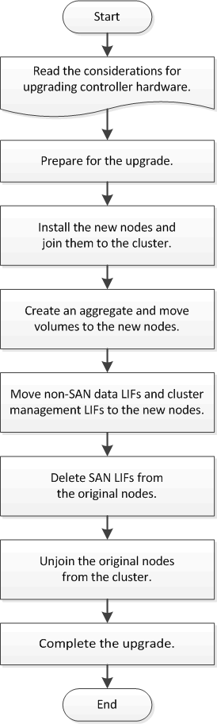

= ボリュームを移動してコントローラハードウェアをアップグレードする
:icons: font
:imagesdir: ../media/

[role="lead"]
ボリュームを移動してアップグレードする場合は、元のノードを準備し、新しいノードをクラスタに追加します。ボリュームを新しいノードに移動し、 LIF を設定して、クラスタから元のノードを削除します。ボリュームの移動によるアップグレード手順は無停止で実行できます。

.手順
. xref:upgrade-prepare-when-moving-volumes.adoc[ボリューム移動時にアップグレードを準備]
. xref:upgrade-install-and-join-new-nodes-move-vols.adoc[新しいノードを設置してクラスタに追加]
. xref:upgrade-create-aggregate-move-volumes.adoc[アグリゲートを作成してボリュームを新しいノードに移動]
. xref:upgrade-move-lifs-to-new-nodes.adoc[SAN 以外のデータ LIF とクラスタ管理 LIF を新しいノードに移動します]
. xref:upgrade-delete-san-lifs.adoc[SAN LIF を元のノードから削除]
. xref:upgrade-unjoin-original-nodes-move-volumes.adoc[クラスタから元のノードを分離]
. xref:upgrade-complete-move-volumes.adoc[アップグレードを完了します]

