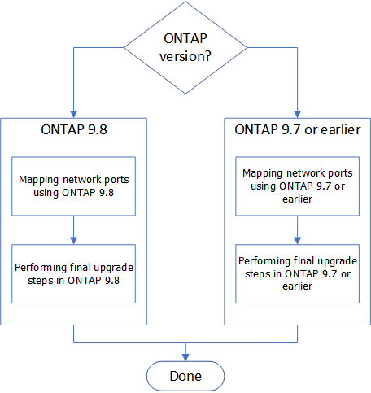

= アップグレードを完了します
:allow-uri-read: 
:icons: font
:imagesdir: ../media/

[role="lead"]
ONTAP 9.8以降またはONTAP 9.7以前でアップグレードを完了します。

使用している ONTAP のバージョンに対応した手順を使用する必要があります。

* xref:upgrade-complete-ontap-9-8.adoc[ONTAP 9.8以降でアップグレードを完了します]
* xref:upgrade-complete-ontap-9-7-or-earlier.adoc[ONTAP 9.7 以前でアップグレードを完了します]

