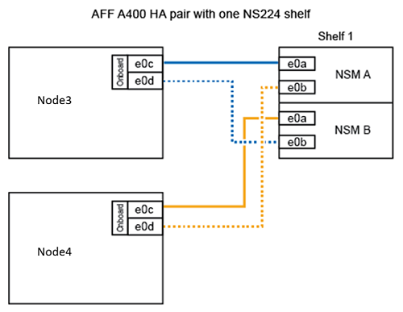

= node1をドライブシェルフに変換し、node3に接続します
:allow-uri-read: 
:icons: font
:imagesdir: ../media/

[role="lead"]
AFF A250 node1をNS224ドライブシェルフに変換し、AFF A400 node3に接続してから、node1からnode3にドライブを再割り当てします。

.手順
. ノード1からすべてのネットワークケーブルを外します。
. ノード1をAFF A250シャーシから取り外します。
. NVMeシェルフモジュール（NSM）をノード1のベイに挿入します。
. ノード3の100GbEポートe0cとNSM Aのポートe0aをケーブル接続して、NSMをノード3に接続します。
+

. node1のポートe0cとe0dの25GbEケーブルを、node3の任意の2つの25GbEオンボードポート（e0e、e0f、e0g、またはe0h）に接続します。
+

NOTE: 25GbEオンボードポートがノード3にない場合は、25GbE PCIeアダプタを使用して接続できます。

